<p align="center">
  
</p>

<p align="center">
  <!-- Domain badges -->
  
  
  
</p>

<p align="center">
  <!-- Tech stack -->
  
  
  
  
  
  
</p>

<p align="center">
  
  
  
  
</p>

---

## 📋 Table of Contents

| # | Section |
|---|---------|
| 1 | [Executive Summary](#-executive-summary) |
| 2 | [Study Area & Dam Profile](#-study-area--dam-profile) |
| 3 | [Scenarios Analyzed](#-scenarios-analyzed) |
| 4 | [Methodology](#-methodology) |
| 5 | [Repository Structure](#-repository-structure) |
| 6 | [Data Sources & Schema](#-data-sources--schema) |
| 7 | [Results & Outputs](#-results--outputs) |
| 8 | [Regulatory Compliance](#-regulatory-compliance) |
| 9 | [Reproducing Results](#-reproducing-results) |
| 10 | [Software Stack & Environment](#-software-stack--environment) |
| 11 | [References & Standards](#-references--standards) |
| 12 | [Author & Citation](#-author--citation) |
| 13 | [Disclaimer](#-disclaimer) |

---

## 🧾 Executive Summary

This repository constitutes the **complete digital technical record** of the hydraulic time-series analysis and engineering visualization of dam breach and controlled release scenarios for **Kurnur (BORI) Dam**, Solapur District, Maharashtra.

The work was conducted in compliance with:

- **Central Water Commission (CWC)** – *Guidelines for Dam Break Analysis*
- **FEMA (2014)** – *Federal Guidelines for Dam Safety: Selecting and Accommodating Inflow Design Floods for Dams*
- **USACE HEC-RAS 6.x** – standard hydraulic modelling framework
- **ICOLD Bulletins** on dam safety and risk assessment
- **National Dam Safety Programme (NDSP)** – Government of India

> ⚠️ **Scope Declaration:** This repository performs **post-processing and engineering visualization only**. Hydraulic breach simulation was conducted upstream in HEC-RAS. No simulation engine is embedded here; all data files are **raw, unmodified model outputs**.

---

## 📍 Study Area & Dam Profile

| Attribute | Detail |
|-----------|--------|
| **Dam Name** | Kurnur (BORI) Dam |
| **River** | Bori River |
| **District** | Solapur |
| **State** | Maharashtra, India |
| **Dam Type** | Earthen Embankment |
| **Governing Authority** | Water Resources Department, Maharashtra |
| **Regulatory Framework** | Dam Safety Act 2021 (GoI); CWC DSO Guidelines |
| **Analysis Reference** | HEC-RAS Dam Break Analysis |
| **Coordinate System** | WGS 84 / Geographic (EPSG:4326) |

### Geographic Context

The Bori River is a tributary within the Bhima basin, draining portions of Solapur District. The Kurnur dam serves irrigation and water supply functions for downstream communities. Its failure — through either **piping** or **overtopping** — would constitute a significant downstream inundation hazard.

---

## 🔬 Scenarios Analyzed

Three independent hydraulic scenarios are modelled and visualized. Each is treated as a **separate, isolated analytical unit** to ensure regulatory traceability.

---

### 1️⃣ Piping Failure (`PIPG`)

| Parameter | Description |
|-----------|-------------|
| **Failure Mechanism** | Progressive internal erosion through the embankment body |
| **Breach Formation** | Gradual — breach widens over time |
| **Hydrograph Shape** | Asymmetric; slower rise, extended recession |
| **Peak Discharge** | Extracted from model time-series |
| **Critical Variables** | Breach width (m), breach velocity (m/s), breach elevation (m) |

**Physical Rationale:** Piping initiates at a concentrated seepage point. As erosion progresses, the conduit enlarges, discharge rises non-linearly, and the dam ultimately collapses through headcut migration or roof collapse. This scenario typically produces a broader, slower hydrograph peak than overtopping.

---

### 2️⃣ Overtopping Failure (`OVTP`)

| Parameter | Description |
|-----------|-------------|
| **Failure Mechanism** | Reservoir overtopping of the crest; erosion of downstream face |
| **Breach Formation** | Rapid — near-instantaneous crest failure |
| **Hydrograph Shape** | Sharp, tall peak; rapid recession |
| **Peak Discharge** | Higher peak than piping; shorter duration |
| **Critical Variables** | Water surface elevation, total and breach discharge |

**Physical Rationale:** Overtopping causes rapid downstream face erosion, leading to sudden structural collapse. The discharge peaks sharply and recedes as the reservoir is drawn down. This scenario governs EAP trigger thresholds and emergency warning timelines.

---

### 3️⃣ Large Controlled Release (`LCR`)

| Parameter | Description |
|-----------|-------------|
| **Operation Type** | Managed spillway/gate release — no breach |
| **Hydrograph Shape** | Smooth, gate-controlled profile |
| **Purpose** | Baseline / reference operational envelope |
| **Critical Variables** | Headwater and tailwater elevations, total discharge |

**Physical Rationale:** The controlled release scenario establishes the **non-failure operational envelope** for comparison. This provides regulatory reviewers and dam safety officers a reference against which failure scenario discharges are contextualized.

---

## 🧭 Methodology

Full methodology documentation: [`docs/methodology/METHODOLOGY.md`](docs/methodology/METHODOLOGY.md)

### Workflow Overview

```
HEC-RAS Simulation Output (Excel .xlsx)
          │
          ▼
  ┌───────────────────┐
  │  Data Ingestion   │  pandas read_excel(), datetime parsing
  │  & Validation     │  unit verification, column alignment
  └────────┬──────────┘
           │
           ▼
  ┌───────────────────┐
  │  Time-Series      │  Peak detection, drawdown slope,
  │  Analysis         │  breach parameter extraction
  └────────┬──────────┘
           │
           ▼
  ┌──────────────────────────────────────┐
  │         Visualization Engine         │
  │                                      │
  │  Static (Matplotlib)                 │
  │  ├── Dual-axis hydrographs           │
  │  ├── Breach width vs. time           │
  │  └── Breach velocity vs. time        │
  │                                      │
  │  Interactive (Plotly)                │
  │  ├── Zoom/pan hydrographs            │
  │  └── Hover-inspection plots          │
  └──────────────────────────────────────┘
           │
           ▼
  ┌───────────────────┐
  │  Output Export    │  PNG (300 DPI), HTML (Plotly)
  │  & Archiving      │  Regulatory annex ready
  └───────────────────┘
```

### Plotting Philosophy

All plots follow **engineering-grade standards** suitable for regulatory submission:

- **Dual Y-axis layout:** Left axis = Elevation (m); Right axis = Discharge (m³/s)
- **Color convention:** Consistent scheme across all scenario plots
- **Annotations:** Peak discharge, time-to-peak, critical water levels clearly labeled
- **No data manipulation:** Raw model output, plotted directly — no smoothing, interpolation, or filtering applied
- **Resolution:** 300 DPI minimum for all static exports

### Data Integrity Guarantee

> All `.xlsx` files in `data/raw/` are **preserved exactly as received from HEC-RAS**. No cells, values, or timestamps have been modified. SHA-256 checksums are provided in [`data/metadata/checksums.sha256`](data/metadata/checksums.sha256).

---

## 🗂️ Repository Structure

```
BORI-DAM-breach-plots/
│
├── 📄 README.md                          ← This document (digital official record)
├── 📄 LICENSE                            ← MIT License
├── 📄 CITATION.cff                       ← Machine-readable citation
├── 📄 CHANGELOG.md                       ← Version history
│
├── 📁 assets/
│   └── banners/                          ← Animated SVG banner & visual assets
│
├── 📁 data/
│   ├── raw/                              ← UNMODIFIED HEC-RAS Excel outputs
│   │   ├── Large_Controlled_Release_Hydrograph.xlsx
│   │   ├── Overtopping_Breach_Hydrograph.xlsx
│   │   ├── Piping_Breach_Hydrograph.xlsx
│   │   └── Overtopping_Piping_Breach_Parameters.xlsx
│   ├── processed/                        ← Derived/cleaned data (if any)
│   └── metadata/
│       ├── DATA_DICTIONARY.md            ← Full parameter definitions
│       ├── checksums.sha256              ← Data integrity verification
│       └── DATA_SOURCES.md              ← Provenance documentation
│
├── 📁 docs/
│   ├── methodology/
│   │   ├── METHODOLOGY.md               ← Full methodology & assumptions
│   │   └── WORKFLOW_DIAGRAM.md          ← Analysis workflow
│   ├── data-dictionary/
│   │   └── PARAMETERS.md               ← Variable definitions & units
│   └── regulatory/
│       └── REGULATORY_ALIGNMENT.md      ← CWC / FEMA / NDSP compliance notes
│
├── 📁 notebooks/
│   ├── 01_Piping_Breach_Hydrograph.ipynb
│   ├── 02_Overtopping_Breach_Hydrograph.ipynb
│   ├── 03_Large_Controlled_Release.ipynb
│   └── 04_Breach_Width_and_Velocity.ipynb
│
├── 📁 src/
│   └── utils/
│       ├── plot_config.py               ← Shared plot styling & config
│       └── data_loader.py               ← Reusable data loading functions
│
├── 📁 figures/
│   ├── static/                          ← PNG outputs (300 DPI)
│   │   ├── PIPG_Piping_Breach.png
│   │   ├── OVTP_Overtopping_Breach.png
│   │   └── LCR_Controlled_Release.png
│   └── interactive/                     ← HTML Plotly outputs
│       ├── PIPG_interactive.html
│       ├── OVTP_interactive.html
│       └── LCR_interactive.html
│
├── 📁 references/
│   ├── REFERENCES.md                    ← Cited standards & publications
│   └── standards/                       ← Key standard extracts & notes
│
├── 📁 environment/
│   ├── requirements.txt                 ← pip dependencies
│   └── environment.yml                  ← conda environment
│
└── 📁 .github/
    ├── workflows/
    │   └── notebook_check.yml           ← CI: notebook linting
    └── ISSUE_TEMPLATE/
        └── bug_report.md
```

---

## 📊 Data Sources & Schema

Full data dictionary: [`data/metadata/DATA_DICTIONARY.md`](data/metadata/DATA_DICTIONARY.md)

### Input Files

| File | Scenario | Key Variables | Time Step |
|------|----------|--------------|-----------|
| `Piping_Breach_Hydrograph.xlsx` | Piping Failure | HW elev, TW elev, Q_total, Q_breach | 5 min |
| `Overtopping_Breach_Hydrograph.xlsx` | Overtopping Failure | HW elev, TW elev, Q_total, Q_breach | 5 min |
| `Large_Controlled_Release_Hydrograph.xlsx` | Controlled Release | HW elev, TW elev, Q_total | 5 min |
| `Overtopping_Piping_Breach_Parameters.xlsx` | Both breach scenarios | Breach width, breach velocity, breach elevation | 5 min |

### Variable Definitions

| Variable | Symbol | Unit | Description |
|----------|--------|------|-------------|
| Headwater Elevation | HW | m (MSL) | Water surface elevation upstream of dam |
| Tailwater Elevation | TW | m (MSL) | Water surface elevation downstream of dam |
| Total Discharge | Q_total | m³/s | All outflows from the reservoir |
| Breach Discharge | Q_breach | m³/s | Flow specifically through the breach opening |
| Breach Width | B_w | m | Width of the breach opening at base |
| Breach Velocity | V_b | m/s | Mean flow velocity through breach section |

### Data Provenance

- **Source model:** HEC-RAS Dam Break Analysis
- **Output format:** Microsoft Excel (.xlsx)
- **Modification status:** None — raw outputs preserved verbatim
- **Time reference:** Relative time from breach initiation (T=0)

---

## 📈 Results & Outputs

### Static Figures (Publication & Submission Grade)

| Figure | Scenario | Description |
|--------|----------|-------------|
| `PIPG_Piping_Breach.png` | Piping | Dual-axis hydrograph: HW/TW elevation + discharge vs. time |
| `OVTP_Overtopping_Breach.png` | Overtopping | Dual-axis hydrograph: HW/TW elevation + discharge vs. time |
| `LCR_Controlled_Release.png` | Controlled Release | Gate-controlled discharge vs. reservoir drawdown |
| `Breach_Width_Velocity.png` | Piping + Overtopping | Breach width (m) and velocity (m/s) evolution vs. time |

All figures are exported at **≥ 300 DPI** — suitable for direct inclusion in:
- Dam Break Analysis (DBA) reports
- Emergency Action Plan (EAP) annexures
- Regulatory submissions to CWC / SDSO
- Technical review presentations

### Interactive Figures (Review Meetings & Presentations)

Plotly HTML files in `figures/interactive/` support:
- Zoom and pan on any time axis
- Hover inspection of exact values
- Toggling individual traces on/off

---

## ⚖️ Regulatory Compliance

This analysis is designed to support compliance with the following frameworks:

| Standard | Body | Relevance |
|---------|------|-----------|
| **Guidelines for Dam Break Analysis** | Central Water Commission (CWC), India | Primary governing standard for this work |
| **Dam Safety Act, 2021** | Government of India | Statutory framework for dam safety obligations |
| **National Dam Safety Programme (NDSP)** | GoI / NDSA | Guidelines for Emergency Action Plans |
| **FEMA P-946 (2014)** | U.S. Federal Emergency Management Agency | Internationally recognized breach analysis guidelines |
| **USACE HEC-RAS Manual** | U.S. Army Corps of Engineers | HEC-RAS modelling reference standard |
| **ICOLD Bulletins 72, 99, 128** | International Commission on Large Dams | International dam safety best practice |

### Submission Readiness Checklist

- [x] Raw data files preserved without modification
- [x] Data provenance and checksums documented
- [x] Methodology fully described with assumptions stated
- [x] Regulatory standards cited for each analytical decision
- [x] Figures exported at regulatory-grade resolution (≥ 300 DPI)
- [x] Scenario isolation maintained (no cross-contamination between runs)
- [x] Limitations explicitly stated
- [x] Reproducibility instructions provided
- [x] Version control history maintained (git log)
- [x] Author identification and contact provided

---

## 🔁 Reproducing Results

### 1. Clone the Repository

```bash
git clone https://github.com/<your-username>/BORI-DAM-breach-plots.git
cd BORI-DAM-breach-plots
```

### 2. Set Up Environment

**Option A — pip:**
```bash
pip install -r environment/requirements.txt
```

**Option B — conda:**
```bash
conda env create -f environment/environment.yml
conda activate bori-dam
```

### 3. Launch Notebooks

```bash
jupyter notebook notebooks/
```

Execute notebooks in order (`01_` → `02_` → `03_` → `04_`). All notebooks are self-contained and reference data from `data/raw/`.

### 4. Verify Data Integrity

```bash
sha256sum -c data/metadata/checksums.sha256
```

All checksums must pass before analysis is considered valid.

---

## 🛠️ Software Stack & Environment

| Tool | Version | Purpose |
|------|---------|---------|
| Python | 3.10+ | Core analysis language |
| Pandas | 2.x | Time-series ingestion and processing |
| Matplotlib | 3.x | Publication-quality static plots |
| Plotly | 5.x | Interactive engineering hydrographs |
| OpenPyXL | 3.x | Excel data reading |
| NumPy | 1.25+ | Numerical operations |
| Jupyter | 7.x | Notebook execution environment |
| HEC-RAS | 6.x | Upstream hydraulic modelling (external) |

**Execution Environment:** Local Jupyter / Google Colab compatible.

---

## 📚 References & Standards

1. **Central Water Commission (CWC).** *Guidelines for Dam Break Analysis.* New Delhi: Ministry of Jal Shakti, Government of India.

2. **FEMA (2014).** *Selecting and Accommodating Inflow Design Floods for Dams (P-94).* Washington D.C.: Federal Emergency Management Agency.

3. **USACE (2021).** *HEC-RAS River Analysis System – User Manual, Version 6.x.* Davis, CA: Hydrologic Engineering Center.

4. **ICOLD (2011).** *Bulletin 99: Dam Failure Statistical Analysis.* Paris: International Commission on Large Dams.

5. **ICOLD (2017).** *Bulletin 128: Dam Safety Management.* Paris: International Commission on Large Dams.

6. **Government of India (2021).** *Dam Safety Act, 2021.* New Delhi: Ministry of Jal Shakti.

7. **National Dam Safety Authority (NDSA).** *Guidelines for Emergency Action Plans (EAP).* New Delhi: NDSA, Government of India.

8. **Froehlich, D.C. (1995).** Embankment dam breach parameters revisited. *Water Resources Engineering*, Proceedings of ASCE, 887–891.

9. **Wahl, T.L. (1998).** *Prediction of embankment dam breach parameters – a literature review and needs assessment.* DSO-98-004, U.S. Bureau of Reclamation.

---

## 👤 Author & Citation

**Satwik Udupi**
Agricultural & Hydraulic Engineer | Hydrology · GIS · Dam Safety Specialization

**Areas of expertise:**
- Dam Break Analysis (DBA) using HEC-RAS 1D/2D
- Hydraulic time-series visualization and analysis
- Flood inundation mapping
- Remote sensing and GIS for water resources

**Cite this work:**

```bibtex
@software{udupi2025bori,
  author    = {Udupi, Satwik},
  title     = {Kurnur (BORI) Dam: Breach \& Hydrograph Analysis},
  year      = {2025},
  publisher = {GitHub},
  url       = {https://github.com/<your-username>/BORI-DAM-breach-plots},
  note      = {Dam break post-processing and engineering visualization.
               Data sourced from HEC-RAS simulation.
               Prepared for CWC/SDSO regulatory submission.}
}
```

Also see [`CITATION.cff`](CITATION.cff) for machine-readable citation metadata.

---

## ⚠️ Disclaimer

This repository is prepared **solely for technical, engineering, academic, and official dam safety reporting purposes**.

1. **Post-processing only:** This repository visualizes and processes hydraulic model outputs. It does not itself perform hydraulic simulation or structural analysis.
2. **Model dependency:** All results are contingent on the accuracy and assumptions of the upstream HEC-RAS model from which data was derived.
3. **No calibration:** No field calibration or observational validation has been performed at this stage.
4. **Indicative results:** Figures and values are indicative and must be interpreted by qualified hydraulic engineers in the context of a complete Dam Break Analysis report.
5. **Liability:** The author assumes no liability for regulatory, design, operational, or emergency management decisions made on the basis of this material.
6. **Version control:** This digital record is version-controlled. The authoritative version is the one tagged in the official git release associated with the regulatory submission.

---

<p align="center">
  <sub>Prepared by Satwik Udupi · Kurnur (BORI) Dam Safety Analysis · Maharashtra, India</sub><br/>
  <sub>Central Water Commission Guidelines · Dam Safety Act 2021 · NDSP Framework</sub>
</p>
